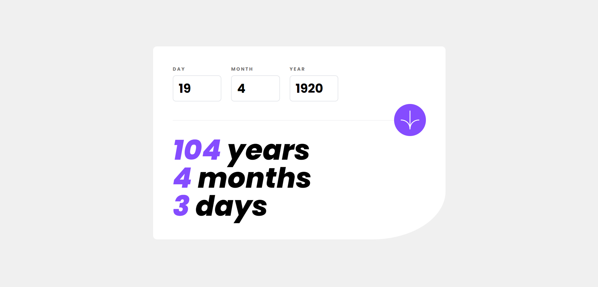

# Frontend Mentor - Age calculator app solution

This is a solution to the [Age calculator app challenge on Frontend Mentor](https://www.frontendmentor.io/challenges/age-calculator-app-dF9DFFpj-Q).

## Table of contents

- [Frontend Mentor - Age calculator app solution](#frontend-mentor---age-calculator-app-solution)
  - [Table of contents](#table-of-contents)
  - [Overview](#overview)
    - [The challenge](#the-challenge)
    - [Screenshot](#screenshot)
    - [Links](#links)
  - [My process](#my-process)
    - [Built with](#built-with)
    - [What I learned](#what-i-learned)
  - [Author](#author)

## Overview

### The challenge

Users should be able to:

- View an age in years, months, and days after submitting a valid date through the form
- Receive validation errors if:
  - Any field is empty when the form is submitted
  - The day number is not between 1-31
  - The month number is not between 1-12
  - The year is in the future
  - The date is invalid e.g. 31/04/1991 (there are 30 days in April)
- View the optimal layout for the interface depending on their device's screen size
- See hover and focus states for all interactive elements on the page
- **Bonus**: See the age numbers animate to their final number when the form is submitted

### Screenshot

### Links

- Solution URL: [GitHub](https://github.com/Atatra/age-calculator-app)
- Live Site URL: [Vercel](https://age-calculator-app-six-gamma.vercel.app)

## My process

### Built with

- Custom CSS Property - For transitioning numbers
- Mobile-first workflow
- Semantic HTML5 markup
- Flexbox
- [React](https://reactjs.org/) - JS library
- [Next.js](https://nextjs.org/) - React framework
- [Day.js](https://day.js.org/) - 2kb Date library

### What I learned

- It's my first time animating stuff with CSS. At first, I wanted to use Odometerjs for the number animation, but after some research, it seems that I could implement it easily.

  - I discovered the STATUS_ACCESS_VIOLATION error on Chrome. My custom CSS property was the issue.  So I reduced the duration of the transition + replaced counter-reset with counter-set. It seems that it fixed the issue, but I'm not sure.   At least my browser haven't crashed ever since.
  - Overall, I'm happy how the animation turned out, but next time I'll consider using a library instead.

- To compute the difference between two dates, I wanted to go with an accurate solution (taking into account leap years and so on). In the end, my own solution wasn't accurate and had a lot of approximation. So I ended up using a library for this task, since it was errorless, but easy to integrate.

## Author

- Frontend Mentor - [@Atatra](https://www.frontendmentor.io/profile/Atatra)
